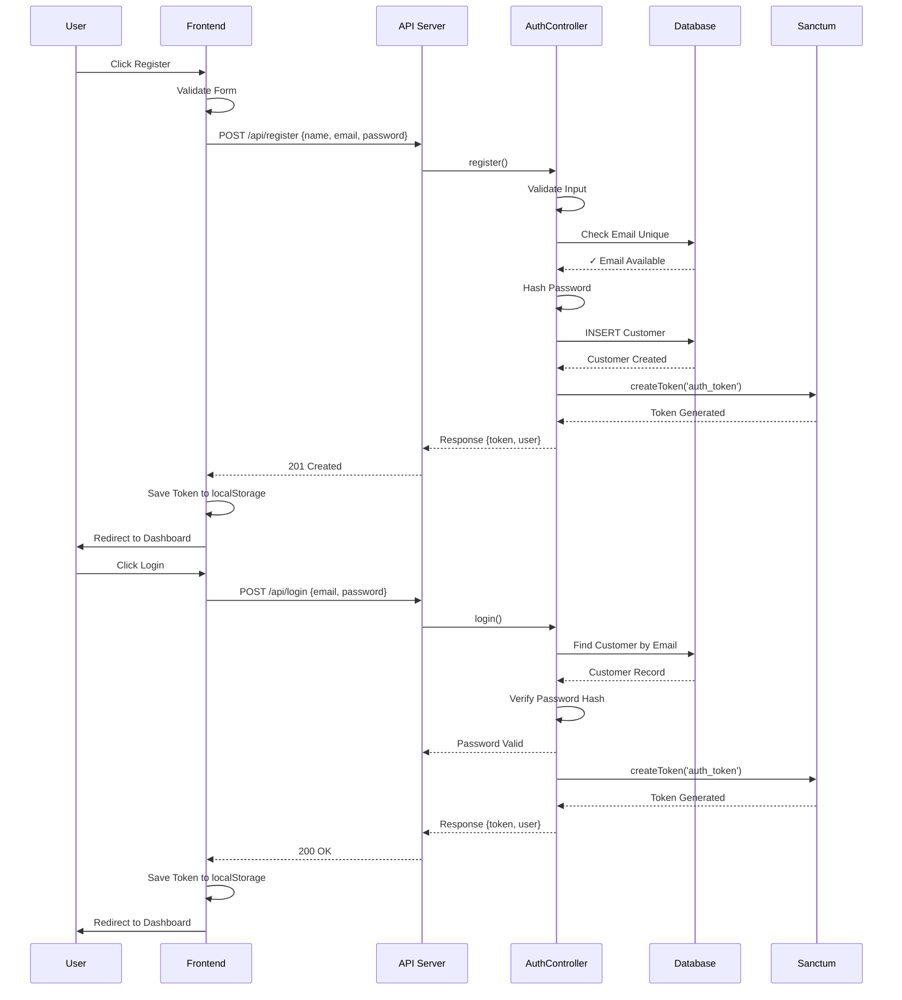
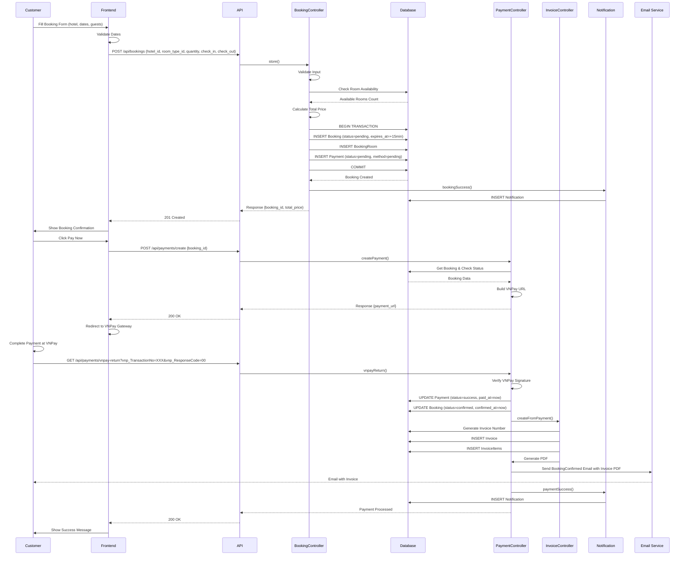
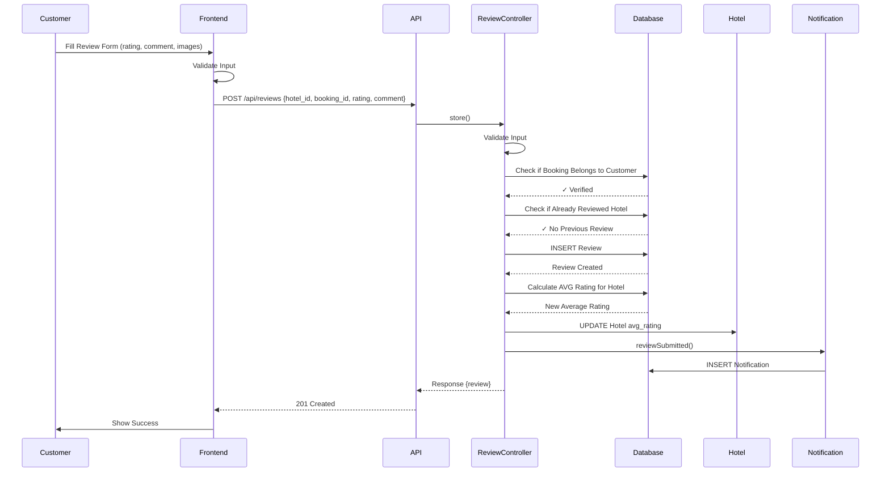
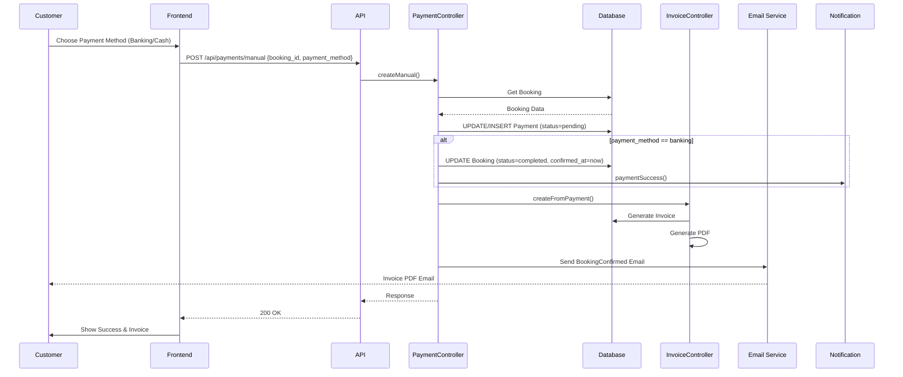
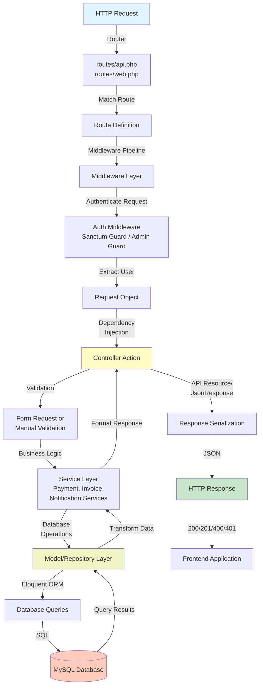

# **COMPREHENSIVE UML DOCUMENTATION - HOTEL BOOKING SYSTEM**

## **1. USE CASE DIAGRAM**

```mermaid
graph TB
    subgraph Actors
        Customer[Customer]
        Guest[Anonymous Guest]
        Staff[Staff/Admin]
        System[System/Cron]
        PaymentGW[Payment Gateway]
    end
    
    subgraph CustomerUseCases
        UC1[Register/Login]
        UC2[Search Hotels]
        UC3[View Hotel Details]
        UC4[Book Hotel Room]
        UC5[Manage Wishlist]
        UC6[Pay via VNPay]
        UC7[Pay via Banking/Cash]
        UC8[Write Review]
        UC9[View My Bookings]
        UC10[Cancel Booking]
        UC11[Chat with Chatbot]
        UC12[Generate Itinerary]
        UC13[View Invoice]
        UC14[View Notifications]
        UC15[Update Profile]
    end
    
    subgraph GuestUseCases
        UC16[Browse Hotels]
        UC17[View Hotel Details]
        UC18[View Reviews]
        UC19[View Locations]
    end
    
    subgraph StaffUseCases
        UC20[Login as Staff]
        UC21[View Dashboard]
        UC22[Manage Bookings]
        UC23[Update Booking Status]
        UC24[Manage Hotels]
        UC25[Manage Customers]
        UC26[View Reviews]
        UC27[View Revenue Reports]
        UC28[Logout]
    end
    
    subgraph SystemUseCases
        UC29[Process VNPay Callback]
        UC30[Expire Pending Bookings]
        UC31[Send Notifications]
        UC32[Generate Reports]
    end
    
    Customer --> UC1
    Customer --> UC2
    Customer --> UC3
    Customer --> UC4
    Customer --> UC5
    Customer --> UC6
    Customer --> UC7
    Customer --> UC8
    Customer --> UC9
    Customer --> UC10
    Customer --> UC11
    Customer --> UC12
    Customer --> UC13
    Customer --> UC14
    Customer --> UC15
    
    Guest --> UC16
    Guest --> UC17
    Guest --> UC18
    Guest --> UC19
    
    Staff --> UC20
    Staff --> UC21
    Staff --> UC22
    Staff --> UC23
    Staff --> UC24
    Staff --> UC25
    Staff --> UC26
    Staff --> UC27
    Staff --> UC28
    
    System --> UC29
    System --> UC30
    System --> UC31
    PaymentGW --> UC29
    
    UC4 -.include.-> UC9
    UC4 -.include.-> UC6
    UC4 -.include.-> UC7
    UC6 -.include.-> UC13
    UC7 -.include.-> UC13
    UC10 -.include.-> UC14
    UC4 -.include.-> UC14
    UC8 -.include.-> UC3
    UC1 -.extend.-> UC15
    UC11 -.extend.-> UC12
```



---

## **2. CLASS DIAGRAM - CORE MODELS WITH RELATIONSHIPS**

```mermaid
classDiagram
    %% Authentication Models
    class User {
        -int id
        -string name
        -string email
        -string password
        -datetime email_verified_at
        -datetime created_at
        +getAuthPassword()
    }
    
    class Customer {
        -int id
        -string name
        -string email
        -string phone
        -string password_hash
        -string avatar_url
        -int preferred_location_id
        -datetime created_at
        +getAuthPassword()
        +bookings()
        +wishlist()
        +reviews()
        +chatSessions()
    }
    
    class Staff {
        -int id
        -int hotel_id
        -string name
        -string email
        -string phone
        -string password_hash
        -string role
        -datetime created_at
        +getAuthPassword()
        +hotel()
        +isSuperAdmin()
        +isAdmin()
    }
    
    %% Location & Destination Models
    class Location {
        -int id
        -string name
        -string region
        -string country
        -decimal latitude
        -decimal longitude
        +hotels()
        +destinations()
        +rooms()
    }
    
    class Destination {
        -int id
        -int location_id
        -string name
        -string category
        -text description
        -string address
        -decimal latitude
        -decimal longitude
        -string google_place_id
        -string image_url
        -decimal avg_rating
        -datetime created_at
        +location()
        +reviews()
    }
    
    %% Hotel & Room Models
    class Hotel {
        -int id
        -int location_id
        -string name
        -string phone
        -string email
        -string address
        -decimal latitude
        -decimal longitude
        -string google_place_id
        -int star_rating
        -text description
        -time check_in_time
        -time check_out_time
        -string status
        -decimal avg_rating
        -datetime created_at
        +location()
        +rooms()
        +amenities()
        +images()
        +reviews()
        +minPrice()
    }
    
    class Room {
        -int id
        -int hotel_id
        -int room_type_id
        -string room_number
        -int floor
        -decimal price
        -int capacity
        -string status
        -datetime created_at
        +hotel()
        +roomType()
        +images()
    }
    
    class RoomType {
        -int id
        -string name
        -int capacity
        -decimal base_price
        -string bed_type
        -text description
        -datetime created_at
        +rooms()
    }
    
    class HotelAmenity {
        -int id
        -int hotel_id
        -string amenity
        -string icon
        +hotel()
    }
    
    class HotelImage {
        -int id
        -int hotel_id
        -string image_url
        -boolean is_primary
        +hotel()
    }
    
    class RoomImage {
        -int id
        -int room_id
        -string image_url
        +room()
    }
    
    %% Booking Models
    class Booking {
        -int id
        -int customer_id
        -int hotel_id
        -int chat_session_id
        -date check_in
        -date check_out
        -int num_guests
        -decimal total_price
        -string status
        -datetime expires_at
        -datetime confirmed_at
        -datetime cancelled_at
        -string cancelled_by
        -text special_request
        -datetime created_at
        +customer()
        +hotel()
        +bookingRooms()
        +payment()
        +rooms()
        +getFormattedPriceAttribute()
    }
    
    class BookingRoom {
        -int id
        -int booking_id
        -int room_type_id
        -decimal price_at_booking
        -int nights
        -int quantity
        +booking()
        +roomType()
        +getPriceAtBookingFormattedAttribute()
    }
    
    %% Payment & Invoice Models
    class Payment {
        -int id
        -int booking_id
        -decimal amount
        -string payment_method
        -enum payment_status
        -string transaction_id
        -datetime paid_at
        -decimal refund_amount
        -datetime refunded_at
        -string refund_note
        -datetime created_at
        +booking()
    }
    
    class Invoice {
        -int id
        -string invoice_no
        -int booking_id
        -int payment_id
        -int customer_id
        -decimal subtotal
        -decimal service_total
        -decimal discount
        -decimal tax
        -decimal total
        -text notes
        -string pdf_url
        -datetime issued_at
        +booking()
        +payment()
        +customer()
        +items()
    }
    
    class InvoiceItem {
        -int id
        -int invoice_id
        -string description
        -int quantity
        -decimal unit_price
        -decimal amount
        +invoice()
    }
    
    %% Review Models
    class Review {
        -int id
        -int customer_id
        -int booking_id
        -int hotel_id
        -int destination_id
        -int rating
        -int rating_cleanliness
        -int rating_service
        -int rating_location
        -text comment
        -int helpful_count
        -datetime created_at
        +customer()
        +booking()
        +hotel()
        +images()
    }
    
    class ReviewImage {
        -int id
        -int review_id
        -string image_url
        +review()
    }
    
    %% Wishlist & Chat Models
    class Wishlist {
        -int id
        -int customer_id
        -int hotel_id
        -datetime created_at
        +hotel()
        +customer()
    }
    
    class ChatSession {
        -int id
        -int customer_id
        -string session_token
        -string title
        -json context_json
        -string status
        -datetime started_at
        -datetime ended_at
        +messages()
        +customer()
    }
    
    class ChatMessage {
        -int id
        -int session_id
        -string role
        -text content
        -string intent
        -json entities_json
        -int referenced_hotel_id
        -int referenced_destination_id
        -datetime created_at
        +session()
        +referencedHotel()
    }
    
    %% Itinerary Models
    class Itinerary {
        -int id
        -int customer_id
        -int session_id
        -string title
        -int destination_id
        -date start_date
        -date end_date
        -int total_days
        -decimal estimated_budget
        -string status
        -datetime created_at
        +user()
        +items()
    }
    
    class ItineraryItem {
        -int id
        -int itinerary_id
        -int day_number
        -string item_type
        -string title
        -string description
        -time start_time
        -time end_time
        -decimal estimated_cost
        -int order_in_day
        +itinerary()
    }
    
    class CustomerNotification {
        -int id
        -int customer_id
        -string type
        -json data
        -datetime read_at
        -datetime created_at
        +user()
        +markAsRead()
        +bookingSuccess()
        +paymentSuccess()
        +bookingCancelled()
        +itineraryReady()
        +reviewSubmitted()
    }
    
    %% Relationships
    Customer ||--o{ Booking : "has many"
    Customer ||--o{ Review : "has many"
    Customer ||--o{ Wishlist : "has many"
    Customer ||--o{ ChatSession : "has many"
    Customer ||--o{ Itinerary : "has many"
    Customer ||--o{ CustomerNotification : "has many"
    
    Staff ||--o{ Hotel : "manages (if not superadmin)"
    
    Location ||--o{ Hotel : "contains"
    Location ||--o{ Destination : "contains"
    Location ||--o{ Room : "has many through hotels"
    
    Hotel ||--o{ Room : "has many"
    Hotel ||--o{ Booking : "has many"
    Hotel ||--o{ Review : "has many"
    Hotel ||--o{ HotelAmenity : "has many"
    Hotel ||--o{ HotelImage : "has many"
    Hotel ||--o{ Wishlist : "has many"
    
    RoomType ||--o{ Room : "defines"
    RoomType ||--o{ BookingRoom : "used in"
    
    Room ||--o{ RoomImage : "has many"
    
    Booking ||--o{ BookingRoom : "has many"
    Booking ||--o{ Payment : "has one"
    Booking ||--o{ Review : "linked to"
    Booking ||--o{ Invoice : "has one"
    Booking ||--o{ ChatSession : "originates from"
    
    BookingRoom ||--o{ RoomType : "specifies"
    
    Payment ||--o{ Invoice : "used in"
    
    Invoice ||--o{ InvoiceItem : "has many"
    
    Review ||--o{ ReviewImage : "has many"
    Review ||--o{ Destination : "can review"
    
    ChatSession ||--o{ ChatMessage : "has many"
    ChatMessage ||--o{ Hotel : "references"
    ChatMessage ||--o{ Destination : "references"
    
    Itinerary ||--o{ ItineraryItem : "has many"
    Itinerary ||--o{ Destination : "related to"
    Itinerary ||--o{ ChatSession : "generated from"
```

---

## **3. CLASS DIAGRAM - CONTROLLERS**

```mermaid
classDiagram
    class Controller {
        <<abstract>>
    }
    
    class AuthController {
        +register(Request): JsonResponse
        +login(Request): JsonResponse
        +loginByPhone(Request): JsonResponse
        +logout(Request): JsonResponse
        +me(Request): JsonResponse
        +updateProfile(Request): JsonResponse
        +updatePassword(Request): JsonResponse
        +forgotPassword(Request): JsonResponse
        +forgotPasswordOtp(Request): JsonResponse
        +forgotPasswordVerifyOtp(Request): JsonResponse
        +resetPassword(Request): JsonResponse
        +loginGoogle(Request): JsonResponse
        +sendPhoneOtp(Request): JsonResponse
        +verifyPhoneOtp(Request): JsonResponse
    }
    
    class BookingController {
        +store(Request): JsonResponse
        +myBookings(Request): JsonResponse
        +show(int id): JsonResponse
        +cancel(int id): JsonResponse
    }
    
    class HotelController {
        +index(Request): JsonResponse
        +show(int id): JsonResponse
        +rooms(Request, int id): JsonResponse
        +mapData(Request): JsonResponse
        +locations(Request): JsonResponse
    }
    
    class PaymentController {
        -string groqUrl
        +createPayment(Request): JsonResponse
        +createManual(Request): JsonResponse
        +show(int booking_id): JsonResponse
        +vnpayReturn(Request): JsonResponse
        +retry(Request): JsonResponse
        -buildVNPayUrl(Booking, string): string
    }
    
    class ReviewController {
        +hotelReviews(Request, int hotel_id): JsonResponse
        +store(Request): JsonResponse
        +destroy(int id): JsonResponse
        +myReviews(Request): JsonResponse
        +helpful(Request, int id): JsonResponse
    }
    
    class ChatController {
        -string groqUrl
        +startSession(Request): JsonResponse
        +sendMessage(Request, int session_id): JsonResponse
        +mySessions(Request): JsonResponse
        +getSession(Request, int session_id): JsonResponse
        +closeSession(Request, int session_id): JsonResponse
    }
    
    class WishlistController {
        +index(Request): JsonResponse
        +add(int hotel_id): JsonResponse
        +remove(int hotel_id): JsonResponse
        +toggle(int hotel_id): JsonResponse
    }
    
    class ItineraryController {
        +index(Request): JsonResponse
        +generate(Request): JsonResponse
        +show(Request, int id): JsonResponse
        +update(Request, int id): JsonResponse
        +destroy(Request, int id): JsonResponse
    }
    
    class InvoiceController {
        +show(int booking_id): JsonResponse
        +index(Request): JsonResponse
        +exportPdf(int booking_id): PDF
        +createFromPayment(Booking, Payment): Invoice
        -formatInvoice(Invoice): array
    }
    
    class AdminController {
        -checkAdmin(Request): Staff
        +dashboard(Request): JsonResponse
        +bookings(Request): JsonResponse
        +updateBookingStatus(Request, int id): JsonResponse
        +hotels(Request): JsonResponse
        +updateHotelStatus(Request, int id): JsonResponse
        +customers(Request): JsonResponse
        +reviews(Request): JsonResponse
        +deleteReview(int id): JsonResponse
        +revenue(Request): JsonResponse
    }
    
    class NotificationController {
        -string table
        +index(Request): JsonResponse
        +markRead(Request, int id): JsonResponse
        +markAllRead(Request): JsonResponse
        +unreadCount(Request): JsonResponse
        +destroy(Request, int id): JsonResponse
        +deleteAll(Request): JsonResponse
    }
    
    class AuthAdminController {
        +login(Request): JsonResponse
        +logout(Request): JsonResponse
        +me(Request): JsonResponse
    }
    
    class RoomController {
        +checkAvailability(Request): JsonResponse
    }
    
    class WebController {
        +home(Request): View
        +hotelDetail(int id): View
        +booking(int id): View
        +dashboard(Request): View
        +login(): View
        +register(): View
        +blog(): View
        +paymentResult(Request): View
    }
    
    class DashboardController {
        +index(): View
    }
    
    class DealsController {
        +index(): View
    }
    
    class BlogController {
        +index(): View
        +detail(int id): View
    }
    
    Controller <|-- AuthController
    Controller <|-- BookingController
    Controller <|-- HotelController
    Controller <|-- PaymentController
    Controller <|-- ReviewController
    Controller <|-- ChatController
    Controller <|-- WishlistController
    Controller <|-- ItineraryController
    Controller <|-- InvoiceController
    Controller <|-- AdminController
    Controller <|-- NotificationController
    Controller <|-- AuthAdminController
    Controller <|-- RoomController
    Controller <|-- WebController
    Controller <|-- DashboardController
    Controller <|-- DealsController
    Controller <|-- BlogController
```



---

## **4. SEQUENCE DIAGRAMS**

### **A. Authentication Flow (Customer)**



### **B. Booking Flow (Complete)**



### **C. Review Creation Flow**



### **D. Payment Processing Flow (Banking/Cash)**



---

## **5. ARCHITECTURE DIAGRAM - REQUEST LIFECYCLE**



---

## **6. DATABASE ENTITY-RELATIONSHIP DIAGRAM**

```mermaid
erDiagram
    CUSTOMER ||--o{ BOOKING : creates
    CUSTOMER ||--o{ WISHLIST : adds
    CUSTOMER ||--o{ REVIEW : writes
    CUSTOMER ||--o{ CHAT_SESSION : starts
    CUSTOMER ||--o{ ITINERARY : creates
    CUSTOMER ||--o{ NOTIFICATION : receives
    
    STAFF ||--|| HOTEL : manages
    STAFF ||--o{ HOTEL : "supervises multiple"
    
    LOCATION ||--o{ HOTEL : contains
    LOCATION ||--o{ DESTINATION : contains
    
    HOTEL ||--o{ ROOM : has
    HOTEL ||--o{ BOOKING : hosts
    HOTEL ||--o{ REVIEW : receives
    HOTEL ||--o{ HOTEL_AMENITY : provides
    HOTEL ||--o{ HOTEL_IMAGE : displays
    HOTEL ||--o{ WISHLIST : "liked by"
    
    ROOM_TYPE ||--o{ ROOM : defines
    ROOM_TYPE ||--o{ BOOKING_ROOM : "specified in"
    ROOM ||--o{ ROOM_IMAGE : "contains images"
    
    BOOKING ||--o{ BOOKING_ROOM : contains
    BOOKING ||--|| PAYMENT : "has one"
    BOOKING ||--|| INVOICE : generates
    BOOKING ||--o{ REVIEW : "reviewed after"
    BOOKING ||--o{ CHAT_SESSION : "originates from"
    
    BookingRoom ||--o{ RoomType : "specifies"
    
    PAYMENT ||--o{ INVOICE : "used in"
    
    INVOICE ||--o{ INVOICE_ITEM : contains
    
    REVIEW ||--o{ REVIEW_IMAGE : "has images"
    REVIEW ||--o{ DESTINATION : "can review"
    
    CHAT_SESSION ||--o{ CHAT_MESSAGE : contains
    CHAT_MESSAGE ||--|| HOTEL : "references"
    CHAT_MESSAGE ||--|| DESTINATION : "references"
    
    ITINERARY ||--o{ ITINERARY_ITEM : contains
    ITINERARY ||--|| DESTINATION : "related to"
    ITINERARY ||--o{ CHAT_SESSION : "generated from"
    
    CUSTOMER {
        int id
        string name
        string email
        string phone
        string password_hash
        string avatar_url
        int preferred_location_id
        datetime created_at
    }
    
    BOOKING {
        int id
        int customer_id
        int hotel_id
        int chat_session_id
        date check_in
        date check_out
        int num_guests
        decimal total_price
        string status
        datetime expires_at
        datetime confirmed_at
        datetime cancelled_at
        text special_request
        datetime created_at
    }
    
    HOTEL {
        int id
        int location_id
        string name
        string phone
        string email
        string address
        decimal latitude
        decimal longitude
        int star_rating
        text description
        time check_in_time
        time check_out_time
        string status
        decimal avg_rating
        datetime created_at
    }